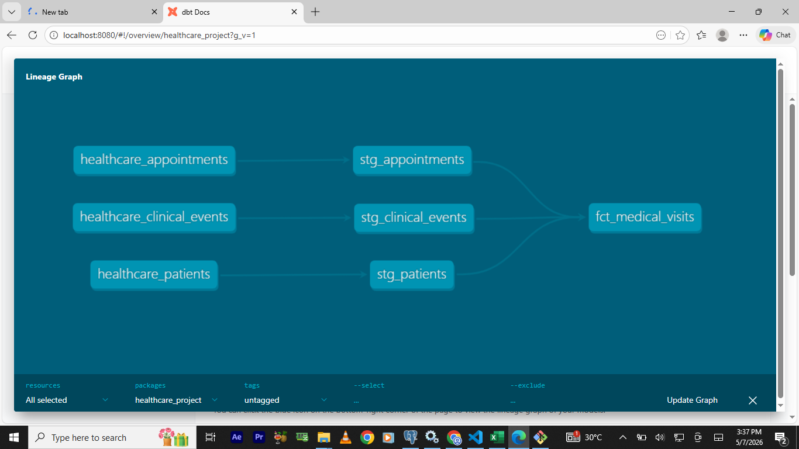
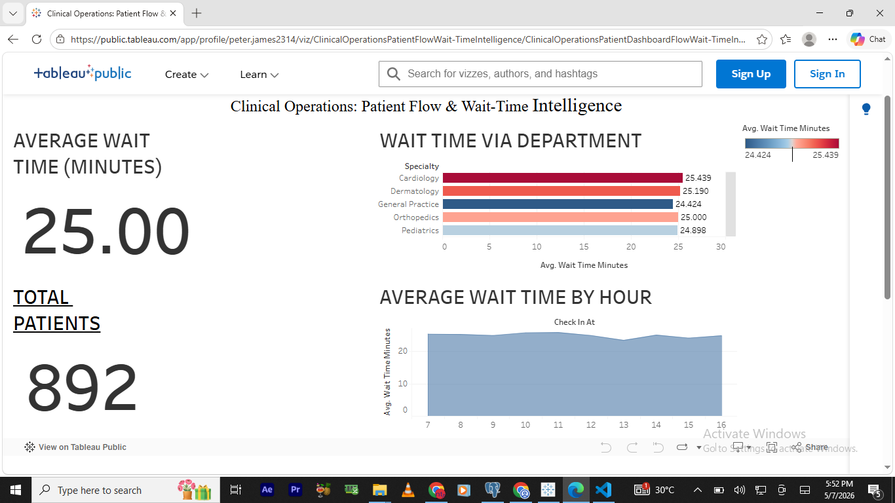

# 🏥 Healthcare Analytics: Patient Wait-Time Intelligence

## 📝 Project Overview
This project transforms raw, unstructured clinical event logs into a high-performance analytics layer. By leveraging the **Modern Data Stack**, I built an end-to-end pipeline that calculates patient wait times, identifies operational bottlenecks, and visualizes key performance indicators (KPIs) for clinic leadership.

---

## 🛠️ Tech Stack
* **Database:** PostgreSQL
* **Transformation:** dbt (Data Build Tool)
* **Data Modeling:** Medallion Architecture (Staging -> Marts)
* **Visualization:** Tableau Public
* **Version Control:** Git

---

## 🏗️ Data Architecture
The pipeline follows industry best practices for modular data modeling:

1.  **Source Layer:** Raw clinical data (Appointments, Patients, Events).
2.  **Staging Layer (`stg_`):** Initial cleaning, renaming, and type casting of raw data.
3.  **Mart Layer (`fct_`):** The "Business Logic" layer where vertical event logs are flattened into a single record per appointment to calculate the duration between **Check-in** and **Vitals Completion**.

### Data Lineage

*Visual representation of the transformation flow from raw seeds to the final fact table.*

---

## 🚀 Key Engineering Challenges Solved

### 1. Handling Incomplete Journeys
Raw clinical data often contains "orphaned" events where a patient checks in but the visit is cancelled before vitals are taken.
* **Solution:** Implemented filtering logic in the Mart layer using `WHERE wait_time_minutes IS NOT NULL` to ensure clinical efficiency KPIs are only calculated based on completed patient journeys.

### 2. Time-Series Logic (SQL)
Using SQL logic, I synchronized disparate timestamps to calculate exact wait durations.
```sql
-- Logic used to calculate the duration in minutes
EXTRACT(EPOCH FROM (vitals_completed_at - check_in_at)) / 60
```

### 3. Automated Data Quality Testing
I implemented automated dbt tests to ensure the "Source of Truth" remains reliable:
* **Uniqueness:** Verified appointment_id is unique to prevent double-counting visits.
* **Not Null:** Guaranteed that every record in the Mart layer has a valid wait time for accurate averaging.


## 📊 Business Insights (Tableau)
The final output is an executive-level Tableau Dashboard designed for Clinic COOs to monitor:
* **Average Wait Time by Specialty:** Identifying which departments (e.g., Cardiology) exceed the 20-minute Service Level Agreement (SLA).
* **Peak Hourly Demand:** Visualizing "Rush Hours" to optimize staff scheduling.
* **Insurance Efficiency:** Checking if specific providers correlate with administrative delays during check-in.

# 📊 Sample Output

After running the `fct_medical_visits` model, the data is structured for immediate use in Tableau, with calculated durations and flattened timestamps:

| appointment_id | patient_id | check_in_at | vitals_completed_at | wait_time_minutes |
| :--- | :--- | :--- | :--- | :--- |
| A00512 | P1024 | 09:00:00 | 09:12:00 | 12.0 |
| A00513 | P2048 | 09:15:00 | 09:40:00 | 25.0 |
| A00514 | P3012 | 10:05:00 | 10:18:00 | 13.0 |

## 📊 Data Visualization: Executive Dashboard
The processed data from the PostgreSQL mart layer was connected to Tableau to create an operational oversight dashboard. This visualization allows clinic administrators to identify high-wait-time outliers and optimize staffing based on hourly patient volume.

### Dashboard Preview


### Key Insights Captured:
* **Departmental Efficiency:** Identifying which specialties consistently exceed the 20-minute wait time threshold.
* **Peak Demand Hours:** Mapping patient check-ins to find the "Rush Hour" bottlenecks (typically 9:00 AM and 1:00 PM).

---
### 🔗 Live Interactive Dashboard
You can view and interact with the live version of this dashboard on Tableau Public here:
[**View Live Project on Tableau Public**](https://public.tableau.com/views/ClinicalOperationsPatientFlowWait-TimeIntelligence/ClinicalOperationsPatientDashboardFlowWait-TimeIntelligence?:language=en-US&publish=yes&:sid=&:redirect=auth&:display_count=n&:origin=viz_share_link)      

# 📂 Project Structure
```
├── dbt_project.yml        # dbt project configuration
├── models/
│   ├── staging/           # Raw data cleaning & standardization
│   └── marts/             # Final fact tables & business KPIs
├── tests/                 # Custom data quality tests
└── README.md              # Project documentation
```

## 📈 Future Enhancements 
* Incorporate "Doctor Entry" timestamps to measure total time spent in the exam room.
* Automate the pipeline using GitHub Actions for Continuous Integration.

# ✉️ Contact & Connect
If you have any questions about this project feel free to reach out!

 **Favour Peter James** 
* **Portfolio** [https://peterjames2019.github.io/]
* **LinkedIn:** [https://linkedin.com/in/favour-peter-43b330263]
* **GitHub:** [https://github.com/peterjames2019]
